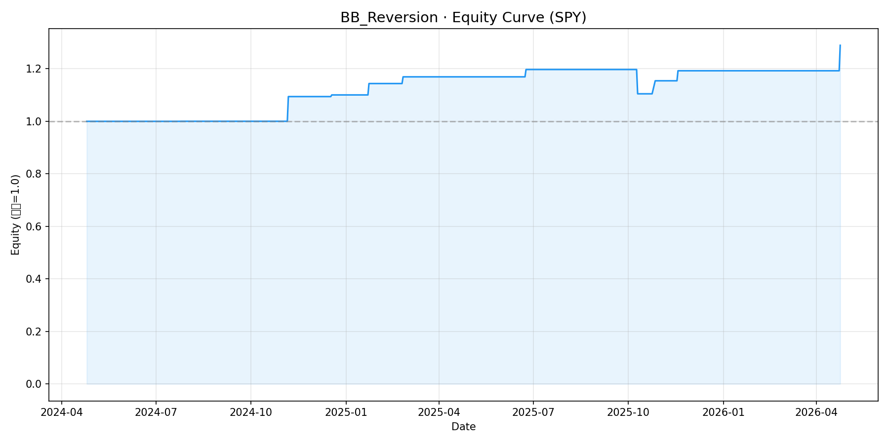
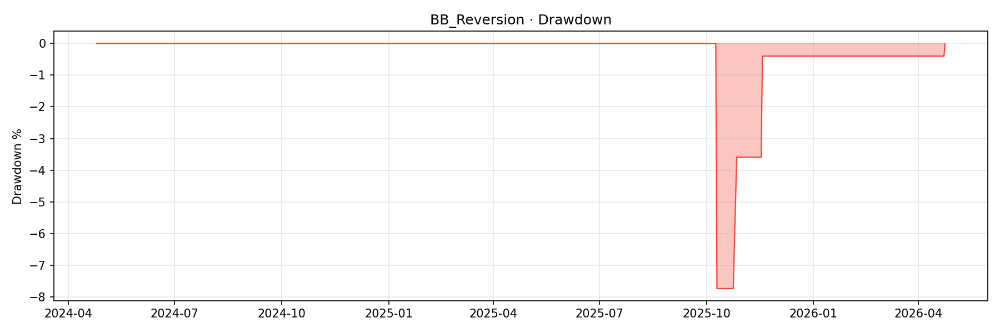

# BB_Reversion 首份绩效报告

**策略**: BB_Reversion（布林带均值回归）
**标的**: SPY (日线)
**数据区间**: 2024-04-25 → 2026-04-24
**初始资金**: $100,000
**生成时间**: 2026-04-25 19:29:58

---

## 一、核心绩效指标

| 指标 | 数值 | 评价 |
|------|------|------|
| 总收益率 | 28.95% | — |
| 年化收益率 | 13.58% | — |
| 夏普比率 | 1.15 | 良好 |
| 最大回撤 | -7.73% | 可控 |
| 胜率 | 90.0% | 偏高（样本量小） |
| 盈亏比 | 4.46 | 良好 |
| 卡玛比率 | 1.76 | 良好 |
| 总交易次数 | 10 | 偏低（2年10笔） |
| 平均盈利 | $3,831 | — |
| 平均亏损 | -$7,728 | — |

## 二、权益曲线

## 三、回撤分析

## 四、交易明细

| 序号 | 入场 | 出场 | 方向 | 盈亏 | 盈亏率 |
|------|------|------|------|------|-------|
| 1 | 2024-06-12 | 2024-07-25 | 空头 📉 | $23 | 0.02% |
| 2 | 2024-07-25 | 2024-11-06 | 多头 📈 | $9,397 | 9.89% |
| 3 | 2024-11-06 | 2024-12-18 | 空头 📉 | $576 | 0.61% |
| 4 | 2024-12-18 | 2025-01-23 | 多头 📈 | $3,938 | 4.14% |
| 5 | 2025-01-23 | 2025-02-25 | 空头 📉 | $2,231 | 2.35% |
| 6 | 2025-02-25 | 2025-06-24 | 多头 📈 | $2,389 | 2.51% |
| 7 | 2025-06-24 | 2025-10-10 | 空头 📉 | $-7,728 | -8.13% |
| 8 | 2025-10-10 | 2025-10-27 | 多头 📈 | $4,488 | 4.72% |
| 9 | 2025-10-27 | 2025-11-18 | 空头 📉 | $3,305 | 3.48% |
| 10 | 2025-11-18 | 2026-04-24 | 多头 📈 | $8,130 | 8.56% |

## 五、风控评价

> **风险审查结果**: ✅ 有条件通过
> - 夏普比率 1.15 ✅
> - 最大回撤 -7.73% ✅
> - 样本量偏小需警惕 ⚠️
> - 建议半凯利仓位 ≤12.5%
> - 详情见 [风险审查报告](risk_review_BB_Reversion.md)

---

*报告由 reporter 生成*