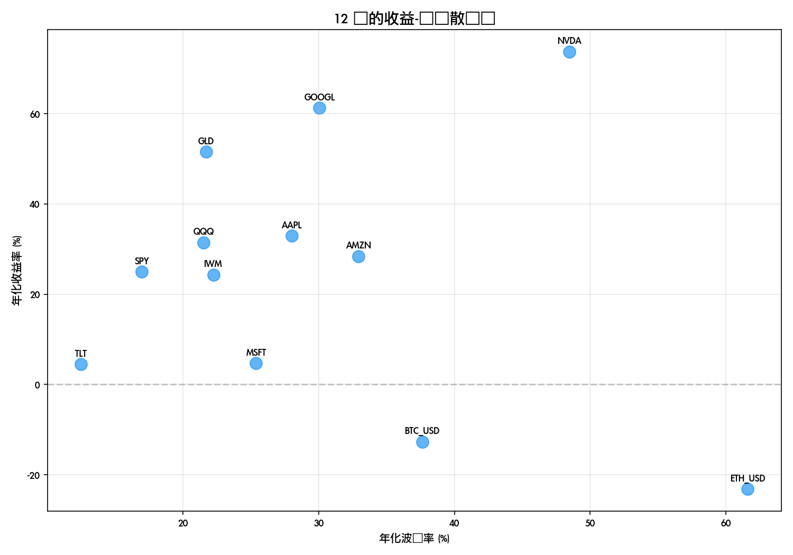
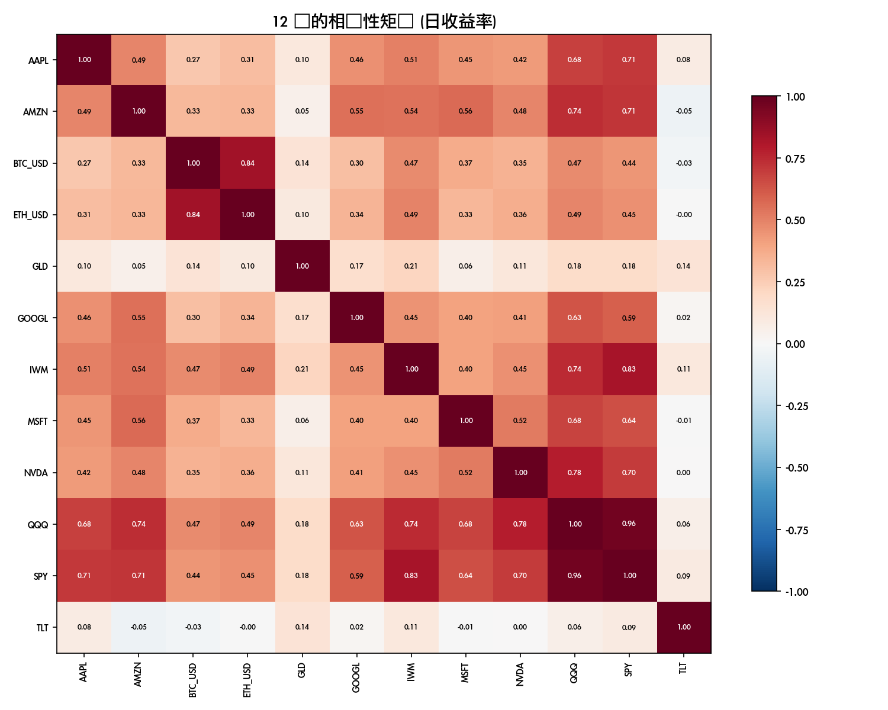
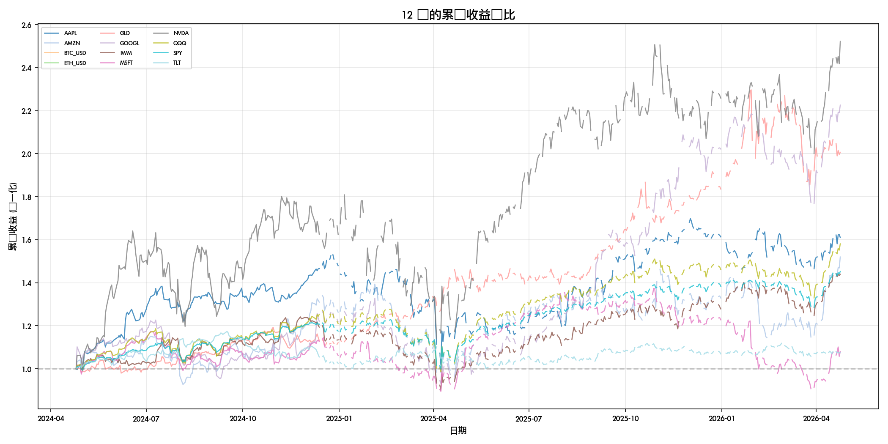

# 全标概览报告

**生成时间**: 2026-04-25 19:29:17
**标的数**: 12
**数据区间**: 2024-04-26 → 2026-04-26

---

## 一、核心指标对比

| 标的 | 总收益率 | 年化收益率 | 年化波动率 | 夏普比率 | 最大回撤 | 卡玛比率 | 最新价 |
|------|---------|-----------|-----------|---------|---------|---------|-------|
| AAPL | 61.00% | 32.90% | 28.02% | 1.17 | -33.36% | 0.99 | $271.06 |
| AMZN | 52.01% | 28.41% | 32.94% | 0.86 | -30.88% | 0.92 | $263.99 |
| BTC_USD | -23.58% | -12.70% | 37.63% | -0.34 | -49.62% | -0.26 | $77553.2 |
| ETH_USD | -40.68% | -23.18% | 61.61% | -0.38 | -63.09% | -0.37 | $2317.99 |
| GLD | 100.65% | 51.57% | 21.72% | 2.37 | -19.21% | 2.68 | $433.25 |
| GOOGL | 122.59% | 61.26% | 30.07% | 2.04 | -29.81% | 2.06 | $344.4 |
| IWM | 43.95% | 24.30% | 22.25% | 1.09 | -27.50% | 0.88 | $276.65 |
| MSFT | 8.04% | 4.73% | 25.40% | 0.19 | -33.91% | 0.14 | $424.62 |
| NVDA | 152.19% | 73.74% | 48.46% | 1.52 | -36.88% | 2.00 | $208.27 |
| QQQ | 58.13% | 31.47% | 21.53% | 1.46 | -22.77% | 1.38 | $663.88 |
| SPY | 45.25% | 24.97% | 16.98% | 1.47 | -18.76% | 1.33 | $713.94 |
| TLT | 7.57% | 4.46% | 12.51% | 0.36 | -14.79% | 0.30 | $86.71 |

## 二、收益-风险分析

散点图左上为优（高收益、低波动），右下为劣（低收益、高波动）。

## 三、相关性分析

**高相关性对 (>0.8):**
- BTC_USD ↔ ETH_USD: 0.841
- IWM ↔ SPY: 0.825
- QQQ ↔ SPY: 0.962

**低相关性/负相关性对 (<0.3):**
- AAPL ↔ BTC_USD: 0.268
- AAPL ↔ GLD: 0.102
- AAPL ↔ TLT: 0.078
- AMZN ↔ GLD: 0.054
- AMZN ↔ TLT: -0.052
- BTC_USD ↔ GLD: 0.140
- BTC_USD ↔ TLT: -0.029
- ETH_USD ↔ GLD: 0.098
- ETH_USD ↔ TLT: -0.005
- GLD ↔ GOOGL: 0.170

## 四、累计收益对比

---

## 五、关键发现

- **年化收益最高**: NVDA (73.74%)
- **年化收益最低**: ETH_USD (-23.18%)
- **夏普比率最优**: GLD (2.37)
- **最佳分散组合**: NVDA ↔ TLT (相关系数 0.002)
- **平均年化波动率**: 29.92%