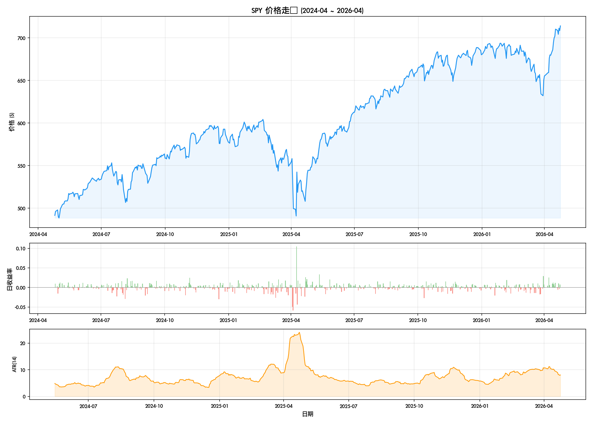
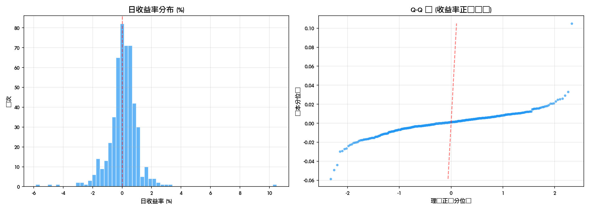
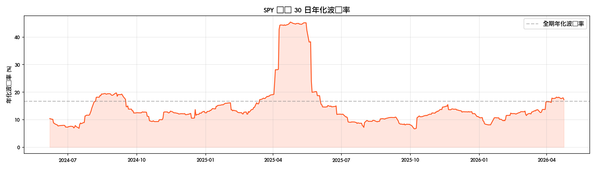

# SPY 描述性统计报告

**生成时间**: 2026-04-25 19:28:17

---

## 一、价格总览

| 指标 | 数值 |
|------|------|
| 数据区间 | 2024-04-25 → 2026-04-24 |
| 交易日数 | 501 |
| 最新收盘价 | $713.94 |
| 期间最高 | $713.94 |
| 期间最低 | $488.46 |
| 均价 | $601.97 |
| 价格标准差 | $58.74 |
| 总收益率 | 45.25% |
| 年化收益率 | 20.65% |

## 二、收益率统计

| 指标 | 数值 |
|------|------|
| 日均收益率 | 0.0802% |
| 日收益率标准差 | 1.0540% |
| 年化波动率 | 16.73% |
| 偏度 | 1.0779 |
| 峰度 | 22.0775 |
| 最大日涨幅 | 10.5019% |
| 最大日跌幅 | -5.8543% |
| 上涨天数 / 下跌天数 | 292 / 208 |
| 平均真实波幅 (ATR) | 7.33 |
| 最新 ATR(14) | 8.05 |

## 三、图表

---

## 四、关键观察

- SPY 在 501 个交易日内实现 45.2% 总回报
- 年化波动率 16.7%，属于中等波动水平
- 偏度 1.08，略右偏（极端涨幅多于极端跌幅）
- 峰度 22.08，厚尾分布（极端事件频率高于正态分布预测）
- 胜率（上涨日占比）: 58.3%